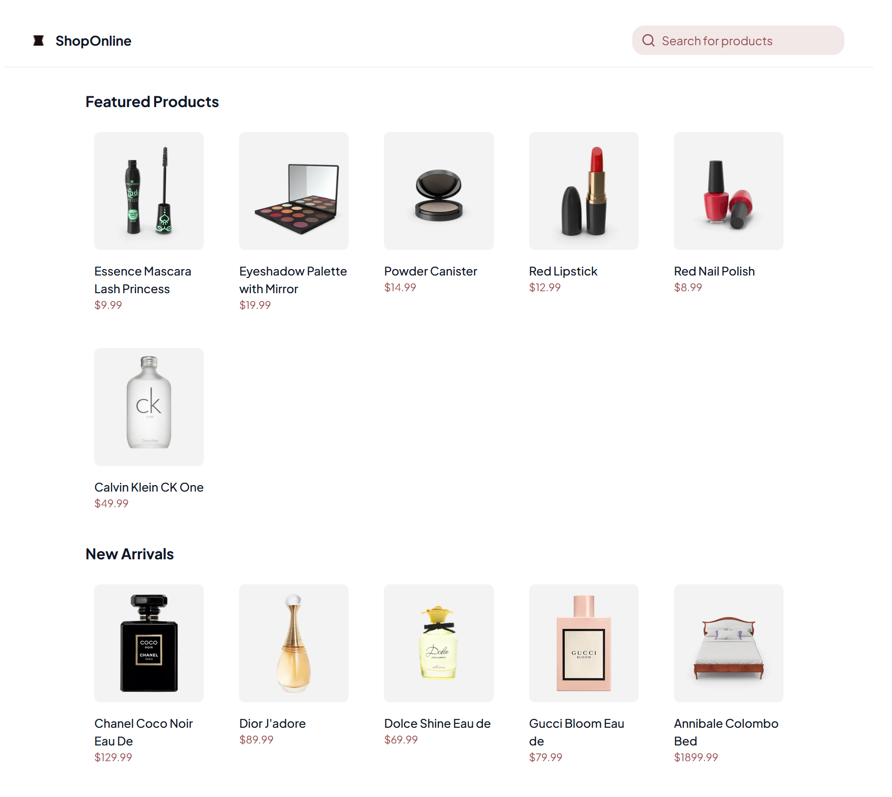

# ShopOnline – React Product Store



Aplikacja sklepu internetowego z produktami, napisana w React + TypeScript, z obsługą paginacji, wyszukiwania, show more oraz responsywnym interfejsem.

## Demo online

Aplikację możesz zobaczyć na żywo na Vercel:  
[https://react-product-store-j61u.vercel.app/](https://react-product-store-j61u.vercel.app/)

## Funkcje

- Pobieranie produktów z publicznego API [dummyjson.com](https://dummyjson.com/products)
- Wyszukiwanie produktów z debounce
- Opcja "Show more" – dynamiczne doładowywanie produktów
- Podział na sekcje: **Featured Products** i **New Arrivals**
- Skeleton loader podczas ładowania
- Obsługa błędów i komunikaty dla użytkownika
- Responsywny grid produktów
- Komponentowa architektura (React + Zustand)
- **Optymalizacja wydajności:**
  - Komponenty sekcji i kart produktów są memoizowane (`React.memo`)
- Automatyczne ponawianie zapytań HTTP przy błędach sieciowych (`retryFetch`)
- Pokrycie testami jednostkowymi (Jest + Testing Library)
- Ikony z biblioteki [Lucide](https://lucide.dev/)

## Zarządzanie stanem i obsługa produktów

- Stan produktów, paginacji, ładowania i błędów jest zarządzany przez **Zustand** w pliku `src/services/productStore.ts`.
- Pobieranie produktów obsługuje:
  - opcja "Show more" – dynamiczne doładowywanie produktów
  - wyszukiwanie z debounce,
  - automatyczne ponawianie zapytań HTTP przy błędach sieciowych (funkcja `retryFetch` z `src/utils/retryFetch.ts`),
  - komunikaty błędów zdefiniowane w `src/config/messages.ts` (np. brak internetu, timeout, błąd ogólny).
- Store eksportuje hook `useProductStore`, który udostępnia:
  - listę produktów,
  - status ładowania,
  - obsługę błędów,
  - aktualną stronę i informację o dostępności kolejnych produktów,
  - funkcje `fetchProducts` i `setQuery`.

## Instalacja

1. **Klonuj repozytorium:**

   ```bash
   git clone https://github.com/Jakubba/react-product-store.git
   cd react-product-store
   ```

2. **Zainstaluj zależności:**

   ```bash
   npm install
   ```

   lub

   ```bash
   yarn
   ```

3. **Uruchom aplikację:**

   ```bash
   npm run dev
   ```

   lub

   ```bash
   yarn dev
   ```

4. **Otwórz w przeglądarce:**  
   [http://localhost:5173](http://localhost:5173) (lub inny port podany przez Vite)

## Testy

Projekt posiada testy jednostkowe dla kluczowych komponentów i logiki.  
Aby uruchomić testy:

```bash
npm test
```

lub

```bash
yarn test
```

Testy wykorzystują **Jest** oraz **@testing-library/react**.  
Mockowane są zasoby statyczne oraz zależności, a testy pokrywają m.in. obsługę błędów, debounce oraz renderowanie.

## Struktura projektu

```
src/
 ├── components/      # Komponenty UI + testy jednostkowe + typy, interface TypeScript
 ├── config/          # Konfiguracja (api.ts, constants.ts, messages.ts)
 ├── pages/           # Strony (Home) + testy jednostkowe
 ├── services/        # Logika pobierania produktów (productStore.ts) + testy jednostkowe + typy, interface TypeScript
 ├── utils/           # Narzędzia pomocnicze (retryFetch.ts)
 ├── App.tsx
 ├── main.tsx
 └── index.css
```

## Stack technologiczny

- **React** + **TypeScript**
- **Zustand** (zarządzanie stanem)
- **TailwindCSS** (styling)
- **Vite** (dev server/bundler)
- **Jest** + **Testing Library** (testy jednostkowe)

## Autor

Jakub B

- (https://github.com/JakubBar)

---
